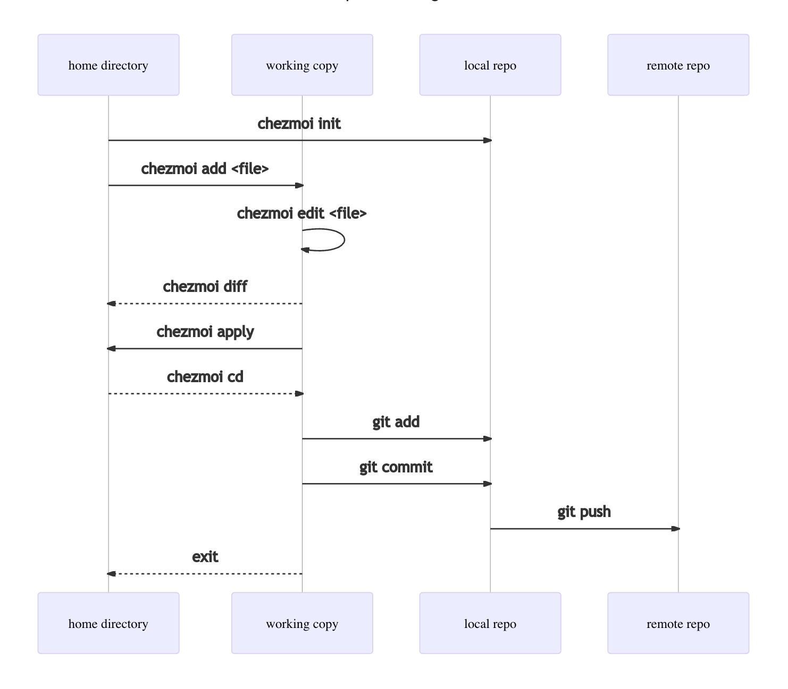

# dotfield

it my dotfield files

## Design

These dotfiles are managed by [Chezmoi][chezmoi]. Why Chezmoi? Chezmoi was
chosen because of its multiplatform support, flexibility, easy of use and its
encryption support.

The dotfiles in this repo are not the end all, be all of configuration. Quite
the opposite, as great care was taken to include the least amount of
configuration. This was done to empower individuals to make it their own. Please
feel free to improve upon the starter. Just keep in mind that its purpose is to
lower the barrier to entry.


## Installation

```sh
mkdir -p ~/.local/share
ssh-add
git clone git@github.com:mkearns87/dotfiles.git ~/.local/share/chezmoi
cd ~/.local/share/chezmoi
# checkout your own branch if you have one, before running this
./scripts/bootstrap/macos.sh
```

## Making it your own

### Creating your own branch

```sh
cd ~/.local/share/chezmoi
git checkout -B u/$USER
git push origin HEAD
```

### TLDR/Examples for Chezmoi

The image below illustrates the overall workflow for adding and editing dotfiles
via Chezmoi. That is followed by examples.



Feel free to read Chezmoi's [Quick start][chezmoi-quickstart] or follow along.

#### Adding more dotfiles

```sh
chezmoi add ~/.config/git
chezmoi cd
git add .
git commit
git push origin HEAD
```

#### Adding/Removing pkgs via brew

Installing:

```sh
brew install zoxide
chezmoi cd
git add .
git commit
git push origin HEAD
```

Uninstalling pkg:

```sh
brew uninstall zoxide
chezmoi cd
git add .
git commit
git push origin HEAD
```

Syncing an uninstall from origin:

```sh
chezmoi update
brew clean -C
```

#### Editing a chezmoi managed file

```sh
chezmoi edit ~/.config/zsh/.zshrc
chezmoi diff
chezmoi -v apply
# saving changes to upstream
chezmoi cd
git add .
git commit -m "Updating zshrc"
git push origin HEAD
```

#### Removing chezmoi managed file

```sh
chezmoi rm ~/.config/git
chezmoi cd
git add .
git commit -m "Deleting git config"
```

#### Syncing changes from remote repo

```sh
chezmoi update
```

## Security

Sensitive information such as the [CPE configuration scrpit][cpe-config] should
not be made publicly available. If you go through the process of Open sourcing
your version of these files, please ensure sensitive data is encrypted.

Under no circumstances should you include encrypted access keys or ssh ids in
your dotfiles. A better alternative would be to use a [Yubikey][yubi-guide] as a
Smart Card for storing authentication keys to use with ssh. Additionally, it is
worth investigating Chezmoi's support of third-party password managers.

## How to encrypt sensitive data?

Please refer to Chezmoi extensive [documentation][encrypt-doc] on the matter.
Another method would be to use a tool independent of Chezmoi such as git-crypt.

## Using git-crypt for storing sensitive information

Let's walk-through encrypting one of the sensitive scripts within this repo.

### Initialize git-crypt

For clarifications on the steps, feel free to consult the [docs][gitcrpyt-docs].

```sh
brew install git-crypt
cd ~/.local/share/chezmoi
git crypt init
```

This will create a special key, it is recommended you safe keep it in a security
focus secrets manager such as LastPass or 1Password to name a few.

```sh
git-crypt export-key ~/Documents/special-git-encryption.key
```

### Encrypt some data

Let's encrypt some sensitive data:

```sh
mkdir sensitive
cat <<EOF >> .gitattributes
sensitive/** filter=git-crypt diff=git-crypt
EOF
awk '!/^{{.*}}$/{print}' \
  .chezmoiscripts/run_after_20-macos-cpe.sh.tmpl >| sensitive/notsosecret.dat
cat <<EOF >| .chezmoiscripts/run_once_after_20-macos-secrets.sh.tmpl
{{ joinPath .chezmoi.sourceDir "sensitive/notsosecret.dat" | include }}
EOF
rm .chezmoiscripts/run_after_20-macos-cpe.sh.tmpl
git add
git commit -m "Adding some sensitive data"
```

Verify encryption.

```sh
git crypt lock
file sensitive/*
```

File type should be data and to ASCII/text.

[chezmoi]: https://www.chezmoi.io/
[encrypt-doc]: https://www.chezmoi.io/user-guide/encryption/
[yubi-guide]: https://github.com/drduh/YubiKey-Guide
[cpe-config]: ./.chezmoiscripts/run_once_after_20-macos-cpe.sh.tmpl
[gitcrypt-docs]: https://github.com/AGWA/git-crypt
[chezmoi-quickstart]: https://www.chezmoi.io/quick-start/
